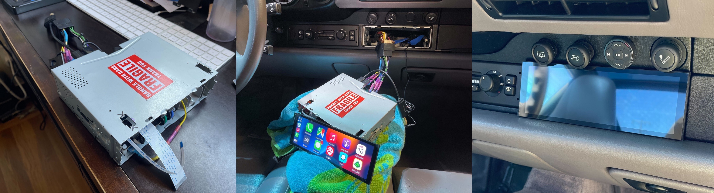

# PorschePi

RaspberryPi based custom head unit for classic Porsche. Inspired by the [Porsche Classic Communication Management (PCCM)](https://shop.porscheusa.com/porscheoem/porsche_classic_/Highlights/porsche_classic_communication_management_pccm_91164559100.html) (91164559100), featuring a 7.9" touchscreen, wireless CarPlay and Bang & Olufsen amplifier.



## Software

- [OpenAuto Pro v16](https://bluewavestudio.io/shop/openauto-pro-car-head-unit-solution/) ($29.99)
- [Plugin CarPlay Autobox for OpenAuto Pro](https://bluewavestudio.io/shop/plugin-carplay-autobox-for-openauto-pro/) ($9.00)
<!-- - [Plugin RTL-SDR for OpenAuto Pro](https://bluewavestudio.io/shop/plugin-rtl-sdr-for-openauto-pro/) ($6.00) -->

> TOTAL: $38.99

## Hardware

- [Raspberry Pi 3 Model B+](https://thepihut.com/products/raspberry-pi-3-model-b-plus?src=raspberrypi) ($35)
- [BeoCreate 4-Channel Amplifier](https://www.pishop.us/product/beocreate-4-channel-amplifier/) ($189.95)
- [Waveshare 7.9inch Capacitive LCD HDMI Display](https://www.amazon.com/7-9inch-Capacitive-LCD-HDMI-Resolution/dp/B087CNJYB4/) ($96.99)
- [SanDisk Extreme PRO microSDHC Memory Card Class 10](https://www.amazon.com/SanDisk-Extreme-microSDHC-Memory-Adapter/dp/B06XYHN68L/) ($13.23)
- [Carlinkit Wireless Carplay Dongle](https://www.amazon.com/Carlinkit-Wireless-Carplay-Android-Compatible/dp/B08FT73V87) ($58.99)
- [Powered USB Hub](https://www.amazon.com/Sabrent-Individual-Switches-Included-HB-UMP3/dp/B00TPMEOYM) ($18.99)
- [USB Microphone Adapter](https://www.amazon.com/UGREEN-External-Headphone-Microphone-Desktops/dp/B01N905VOY) ($13.99)
- [3.5mm TS to TRS](https://www.amazon.com/CablesOnline-2-Pack-Stereo-Adapters-AD-A37G-2/dp/B07787WMHG) ($5.95)
- [Bluetooth Media Remote Button](https://www.amazon.com/Wireless-Bluetooth-Motorcycle-Steering-Bracket/dp/B081RG3NKC) ($17.99)
- [GPIO Female to Female Jumper Wires](https://www.amazon.com/dp/B09FP1WF8Q) ($5.99)
- [12v 16AWG Cables (5ft/Color)](https://www.amazon.com/Fermerry-Silicone-Stranded-Automotive-Electronic/dp/B089CPH72F?th=1) ($15.62)
- [12v Timer Relay](https://www.amazon.com/Timer-CONFIGURABLE-CYCLING-OPTIONAL-TRIGGER/dp/B083HN673G/) ($34.99)
- [12v to 5v Stepdown](https://www.amazon.com/Regulator-Converter-12V-Waterproof-Transformer/dp/B09SD9SH8C) ($13.99)
- [SPDT Relays](https://www.amazon.com/Pack-EPAuto-Relay-Harness-Bosch/dp/B072QXDZRD/) ($10.97)
- [Heatshrink Crimp Connectors](https://www.amazon.com/TICONN-Connectors-Waterproof-Electrical-Automotive/dp/B08NWBRV4K) ($9.99)
- [T-Tap Wire Connectors](https://www.amazon.com/dp/B07XMJ5KTY) ($9.95)
- [Nylon Standoffs](https://www.amazon.com/dp/B07DPPNBFN) ($12.89)
- [Heatshrink Tubbing](https://www.amazon.com/560PCS-Heat-Shrink-Tubing-Eventronic/dp/B072PCQ2LW/) ($6.99)
- [6-Pin Ribbon Cable](https://www.amazon.com/dp/B07S19M2G1) ($6.69)
- [6-Pin Extension Connector](https://www.amazon.com/dp/B07RWNDFV1) ($7.99)
- [40-Pin Ribbon Cable](https://www.amazon.com/dp/B09CL53KZF) ($6.90)
- [Heatsinks](https://www.amazon.com/dp/B08N68V2N9) ($4.59)
<!-- - [FM Radio RTL-SDR USB Adapter](https://www.amazon.com/NooElec-NESDR-Smart-Enclosure-R820T2-Based/dp/B01HA642SW) -->

> TOTAL: $598.63

## Tools

- USB Keyboard & Mouse for setup
- DC 5V 3A Power Supply for Pi setup
- [DC 12V 5A Power Supply for Amplifier setup](https://www.amazon.com/ALITOVE-Adapter-Converter-100-240V-5-5x2-1mm/dp/B01GEA8PQA/)
- Power Drill
- Dremel Tool
- [Heat Gun](https://www.amazon.com/Portable-Handheld-Crafts-Embossing-Wrapping/dp/B08Z3GQN6X/)
- Wire Stripers
- [Crimping Tool](https://www.amazon.com/dp/B07S4HDGK9)

> The cost of tools was omitted as most were owned, borrowed or will remain after this project.

## Cost

> TOTAL: $637.62
>
> TARGET: < $1,350.10

## Resources

### BlueWave Studio

- [Supported Keystrokes](https://bluewavestudio.io/community/thread-2048.html)
- [Graceful delayed shutdown example](https://bluewavestudio.io/community/thread-1128.html)

### HiFiBerry BeoCreate

- [Setup Instructions](https://www.hifiberry.com/docs/software/configuring-linux-3-18-x/)
- [Documentation](https://www.hifiberry.com/beocreate/beocreate-doc/)
- [Support Forums](https://support.hifiberry.com/hc/en-us/community/topics/115000377385-DSP-boards-and-Beocreate)
- [Repo](https://github.com/hifiberry/hifiberry-os)
- [DSP Toolkit](https://github.com/hifiberry/hifiberry-dsp/blob/master/doc/dsptoolkit.md)

### WaveShare

- [Documentation](https://www.waveshare.com/wiki/7.9inch_HDMI_LCD)

### Timers Shop

- [Website](http://timers.shop/6V-28V-10-Amp-Timer-Wi-Fi-configurable-via-phone_p_44.html)
- [Documentation](https://timers.shop/assets/documentation/Multifunctional_Timer_Wifi.pdf)
- [Configuration Video](https://www.youtube.com/watch?v=wqbvz5oopu0&feature=emb_title)

## Setup

For the following instructions, connect a regular display and use a keyboard & mouse until you have completed the `Waveshare Touchscreen` step.

### OpenAuto

- [Flash](https://www.balena.io/etcher/) your `openauto-pro-16.0.zip` image to the SD card
- Remount & run `sh copy_helpers.sh /Volumes/boot/`
- Insert the SD Card into the Pi, and boot up the setup
- Use `1`, `2`, `UP`, `DOWN` and `ENTER` keys to work your way through the wizard

### Autobox (CarPlay)

- Once on the main screen, select `Autobox`, and `Browse`
- Go to `/boot/porschepi/` and select `openauto_autobox_plugin.zip`
- Then select `Enter serial...`, and use your plugin license key
- Select `Finish`, and from your iPhone, connect the the bluetooth device named `AutoKit-****`
- Wait for it to associate the wifi network, at which point the interface should appear
- Within CarPlay, select `Car` to return to OpenAuto

### Pi Settings

- Use [Power] -> [Exit] to reach the Pi's desktop
- Go through the "Welcome to Raspberry Pi" setup but ignore the "Set Up Screen" step for now, do NOT update packages
- Make sure SSH is enabled under the Raspberry Pi Configuration, use the command `ifconfig` to make note of the Pi's assigned IP on the network
- Under `Preferences` -> `Appearance Settings`, change the wallpaper to `/boot/porschepi/splash.png` and invert the Menu Bar's colors
- Under `Preferences` -> `Raspberry Pi Configuration`, change the hostname to `Porsche`
- Execute `cd /boot/porschepi && sudo sh apply_configs.sh` and wait for the Pi to power down

### WaveShare Touchscreen

- Connect the Waveshare touchscreen and restart the Pi
- If you still need to adjust your screen orientation, do the following
  - [Power] -> [Exit] out of OpenAuto
  - Go to `Screen Configuration`, `Configure`, `Screens`, `HDMI-1`, `Orientation`
  - Using the "Rotate Touch" button behind the screen, press for until you see a green flash to rotate the touch

### Bluetooth Remote

- Press any button on the bluetooth remote, it should start blinking
- From the Pi's desktop, go to `Preferences` -> `Bluetooth Manager`
- In the list of devices, select `Jetion remote v2.0`
- Under `Device`, select `Pair` then `Trust`

### BeoCreate

- Refer to `beocreate/docs/jumpers.png` and remove jumper 4 & 5 on the Beocreate HAT.
- Refer to `beocreate/docs/connectors.png` to know how to wire in the soundcard to your speakers
- Connect the Pi to the BeoCreate HAT and power it up using the 12v input
- Lower the volume in OpenAuto (or from the Pi's Sound Preferences) to avoid damaging your speakers when first testing
- Execute `cd /boot/porschepi/beocreate && sudo sh setup.sh`

### Create a Backup

- Make an image of your SD card using `sudo dd bs=4m if=/dev/disk2 of=builds/porschepi-X.Y.Z.img`
- Reflash this image anytime to a similar sized SD card to restore this setup

## Assembly

### Diagram

[](https://www.circuit-diagram.org/editor/c/6b1c75bd69934876a32e00b4504df468)

### Form

First, you need to separate the screen from its PCB carefully using a knife. I recommend you disconnect its ribbons and tape them safely out of the way to avoid damaging them. Once done, upgrade to the longer ribbons to provide more working room between the board and display.


I recommended you bench test components independently before mounting them. Keep in mind to space out components which produce heat, such as the PCB stack from other parts. Use heatsinks to help dissipate the heat from the PCB stack.

For the timer, temporarily wire it to a power source according to the previous schematics, and ground the white wire while you power it on to enable wifi configuration. Connect to its network and visit the IP listed on the timer. Import the configuration `timer/configuration.bin`, or set it to Function 12 with a timer t1 of 5 minutes and trigger value of 2. As seen in the diagram, its recommended you make this configuration wire output from your unit; you can then add a T-tap (or similar) to your ground wire to easily connect it at any time to make adjustments to its configuration.


To test or wire in the automotive relay (to monitor the state of the ignition), enable the power monitoring by setting `POWER_MONITOR_ENABLED=1` in `/boot/porschepi/settings.conf`. When ignition is cutoff, the screen and sound is turned off during a grace period at the end of which the system is shutdown. If ignition is restored, the screen and sound are re-enabled and any shutdown canceled. The script is setup to use GPIO / BCM 16 - physical pin 32 on Beocreate GPIO. This allows the use of the neighboring ground on pin 34, as seen below.


### Fit

As with the PCCM, one of the goals of this project is to fit into a standard single DIN format. After finding an old unit, take it apart and gut out its components to reuse the shell as a donor for your new hardware.


Using the previously mentioned diagram, arrange the components within the shell accordingly. Using a Dremel tool, you can clean up mounting points and cut out any conflicting parts of the shell.


Once the unit is completed, wire it into the harness used to connect the head unit to the car. Optionally, you can add a 15AMP fuse onto the positive power input to insulate your unit from other components relying on your vehicle's existing fuse.


### Finish

As a safety measure, remove the fuse corresponding to the head unit in your car, then connect the harness before reapplying the fuse. Verify that all functions are working before proceeding with inserting the unit into the dashboard.


If you run into issues, check out the Troubleshooting section below for some common issues. Once you've verified your setup, insert the unit into the dashboard carefully, making sure wires behind it are clearing any obstructions and not getting pinched. You can access the back of the unit through the underside of the dashboard. Don't forget to mount the bluetooth remote as well.


🚧 WORK IN PROGRESS (START) 🚧

I am currently working on getting a mounting frame 3D printed to hold the screen in place (safely), this section will be updated when completed. Please come back later for design files and instructions.


🚧 WORK IN PROGRESS (END) 🚧

## Troubleshooting

### System Logs

You can find logs for OpenAuto under `/home/pi/.openauto/cache/openauto.log`.

### CarPlay

If you need to reset your CarPlay connection on your device, go to Settings.app, and forget both Bluetooth and Wifi networks for `AutoKit-****`. Then reconnect via bluetooth to re-initiate the pairing process.

### Display

If you see black borders around the screen, try disabling `disable_overscan=1` and adapting the `overscan_*` properties in `/boot/config.txt`.

### Splash

To make a new splash screen based on a sequence of 24 images use the following command:

```bash
ffmpeg -r 24 -f image2 -s 1280x400 -i rpi/splash_%01d.png -start_number 1 -vframes 24 -vcodec libx264 -crf 25 -pix_fmt yuv420p splash.h264
sudo cp -f ~/splash.h264 /usr/share/openautopro/splash1.h264
sudo cp -f ~/splash.h264 /usr/share/openautopro/splash2.h264
```

### Custom Keys

To add keymaps, use `DISPLAY=:0.0 xev` to find the correct keycode and add mappings to `/boot/porschepi/restore-settings.sh` using `xmodmap`.

### Volume

To change the default volume of the amplifier (not the default software volume), change the value of `VOLUME` in `/boot/porschepi/settings.conf`. Adjust this according to what your speakers can handle.

When using the Bluetooth Remote, if the volume is lowered or raised too fast repetitively, the left and right channel can become unbalanced (different volume) due to a bug. If this occurs, use the "Reset Volume" application in OpenAuto.

### Power Monitor

If you run into issues with the power monitoring service, you can check its status using `systemctl status power-monitor.service` or disable its operation using `POWER_MONITOR_ENABLED=0` in `/boot/porschepi/settings.conf`. To check the service's logs run `journalctl -u power-monitor.service` and use `POWER_MONITOR_DEBUG=1` to make it print out debug statements.

If you ever make changes to the Timer's power cutoff timing, make sure to adjusts the `SHUTDOWN_DELAY` accordingly in `/boot/porschepi/power-monitor.py`. The value of `SHUTDOWN_DELAY` should always be smaller than that of the timer, with enough time to allow for a graceful shutdown before power is cutoff.

## Omitted Components

Here is a list of components which were considered at some point but omitted in the end for one reason or another:

- [Raspberry Pi 4 Model B 2019 Quad Core 64 Bit WiFi Bluetooth (4GB)](https://www.amazon.com/Raspberry-Model-2019-Quad-Bluetooth/dp/B07TC2BK1X)
  - Unable due to shortage
- [CarPiHat](https://thepihut.com/products/carpihat-car-interface-hat-for-raspberry-pi?variant=41600908492995)
  - Incompatible with 4-Channel Amplifier HAT
- [ELM327 OBD to USB Adapter](https://www.amazon.com/gp/product/B083FML519/)
  - Poor access to OBD in car, impractical with little reward
